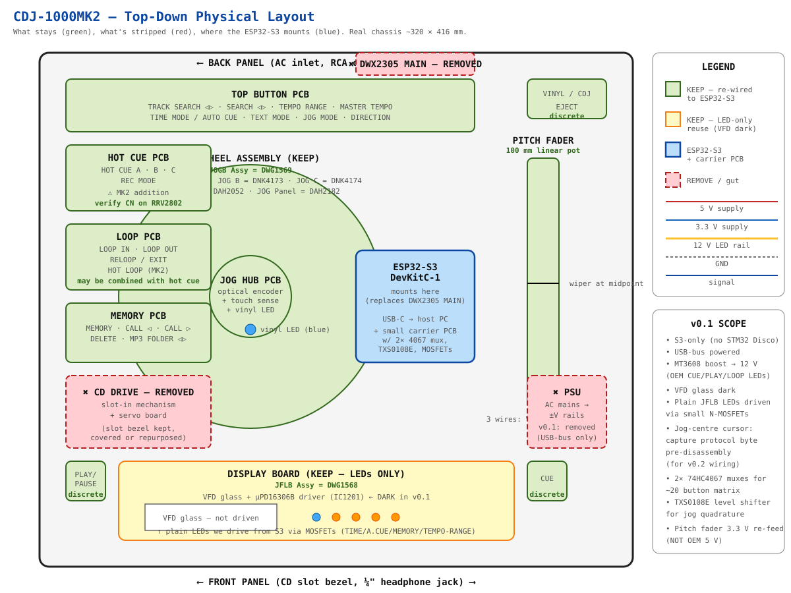
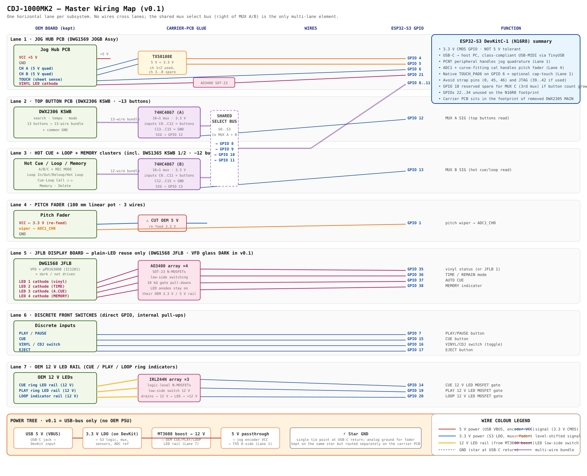

# cdj1000

### Pioneer CDJ-1000MK2 → ESP32-S3 USB-MIDI controller for Traktor Pro 4

Resurrect a Pioneer CDJ-1000MK2 (2003, no native USB/MIDI) as a class-compliant USB-MIDI / HID controller for Traktor Pro 4. The OEM mainboard and CD drive are removed; the chassis, jog wheel assembly, pitch fader, button PCBs (including the MK2-added Hot Cue A/B/C and Hot Loop buttons), pots, and encoders are kept and re-wired to an **ESP32-S3 DevKitC-1 (N16R8)** that speaks USB-MIDI natively via TinyUSB.

> **Status:** architecture v0.5 — **v0.1 scope locked**: S3-only USB-MIDI controller, no big display, optionally reuse the JFLB LED indicators (not the VFD glass) for power-on feedback. **Firmware = ESPHome on esp-idf** + 2 custom external components (USB-MIDI, jog quadrature). The deck never reboots on WiFi or HA disconnect, so it works as a plain USB-MIDI controller anywhere. See [`firmware/README.md`](firmware/README.md). Path D (OEM display reuse via panel↔main protocol replay) is **deferred to v0.2+** — see [`docs/wiring/08-display.md`](docs/wiring/08-display.md).

---

## Block diagrams

The two master views first; per-subsystem schematics live under [`docs/images/`](docs/images/) and are linked from the wiring index in [`docs/wiring/README.md`](docs/wiring/README.md).

### Physical chassis layout — what stays, what's gutted



### Master wiring map — every signal between S3 and the kept OEM boards



### Per-subsystem schematics

| Subsystem | Doc | Diagram |
|---|---|---|
| Master board map | [00-board-map.md](docs/wiring/00-board-map.md) | [physical](docs/images/00-physical-layout.svg) · [wiring](docs/images/00-detailed-wiring.svg) · [system overview](docs/images/00-system-overview.svg) |
| 01 Jog encoder | [01-jog-encoder.md](docs/wiring/01-jog-encoder.md) | [SVG](docs/images/01-jog-encoder.svg) |
| 02 Jog touch | [02-jog-touch.md](docs/wiring/02-jog-touch.md) | [SVG](docs/images/02-jog-touch.svg) |
| 03 Pitch fader | [03-pitch-fader.md](docs/wiring/03-pitch-fader.md) | [SVG](docs/images/03-pitch-fader.svg) |
| 04 Button mux | [04-buttons-mux.md](docs/wiring/04-buttons-mux.md) | [SVG](docs/images/04-buttons-mux.svg) |
| 07 Display research (historical) | [07-display-research.md](docs/wiring/07-display-research.md) | — |
| 08 Display v0.1 plan | [08-display.md](docs/wiring/08-display.md) | — |

---

## Why ESP32-S3 (not Teensy)

Prior community builds (Lee Smith / DJLegionUK) used Teensy 3.6. The S3 wins on:

- Native USB-OTG → class-compliant USB-MIDI via TinyUSB, no shield/adapter
- More GPIO + 2× ADC blocks, PCNT peripheral for jog quadrature, RMT for WS2812
- 8 MB PSRAM → enough framebuffer headroom for an optional jog-center IPS display
- WiFi/BLE for future Ableton Link / OSC / wireless config
- Cheaper, current production silicon

---

## Hardware re-use map

| Kept | Replaced |
|---|---|
| Chassis, top plate, jog wheel assembly | Pioneer mainboard |
| Jog optical encoder (~135 frames/rev — verify MK2) | CD drive + servo board |
| Jog touch sheet | OEM display board |
| 100 mm pitch fader | OEM VFD (optional re-use — see [`07-display-research.md`](docs/wiring/07-display-research.md)) |
| Button PCBs — search, tempo, master tempo, time, direction, memory, delete, jog mode, vinyl/CDJ + MK2 Hot Cue A/B/C + Hot Loop | Power supply (USB-powered now) |
| Pots & rotary encoders | |
| CUE / PLAY / LOOP LEDs (12 V — driven via MOSFETs) | |

---

## Wiring overview

Detailed per-subsystem wiring docs live in [`docs/wiring/`](docs/wiring/). Quick reference:

| Subsystem | OEM source | ESP32-S3 GPIO | Notes |
|---|---|---|---|
| Jog rotation | DEC2498 encoder plate (CH A/B) | GPIO 4 / 5 (PCNT) | 5 V → 3.3 V level shift (TXS0108E) |
| Jog touch | DSX1060 sheet sense | GPIO 6 | Verify cap vs pressure |
| Pitch fader | 100 mm linear pot wiper | GPIO 1 (ADC1_CH0) | Cut OEM 5 V; re-feed slider from 3.3 V |
| Buttons (~20 incl. MK2 hot cue A/B/C + hot loop) | Button PCBs | 2× 74HC4067, S0–S3 = GPIO 8/9/10/11, SIG = GPIO 12/+1 — may need 3rd mux on MK2 |
| PLAY / PAUSE | discrete | GPIO 7 | |
| CUE | discrete | GPIO 15 | |
| VINYL/CDJ switch | discrete | GPIO 16 | |
| OEM CUE/PLAY/LOOP LEDs | 12 V rail | IRLZ44N from GPIO | Lee Smith MK1 gotcha |
| Status / pad RGB | new | WS2812 ← GPIO 13 | |
| Display (optional) | new | GC9A01 SPI or SSD1306 I2C | jog-center vs status |
| Power | USB 5 V → VBUS | 3.3 V LDO; MT3608 boost for 12 V LEDs only | Star ground |

Full GPIO table and wiring SVGs: [`docs/wiring/README.md`](docs/wiring/README.md).

---

## Reference builds

| Project | Why it matters |
|---|---|
| [djgreeb/CDJ-1000mk3_new_life_project](https://github.com/djgreeb/CDJ-1000mk3_new_life_project) | **Display path D source.** STM32F746G-DISCO + custom firmware simulating the CDJ-2000nxs UI, SD-card audio, slip mode, RGB waveform. MK3-only upstream; we're porting to MK2. Repo ships the MK3 panel↔main serial protocol decode (`Reverse Engineering Pioneer CDJ-1000 serial protocol.pdf`, by Anatsko Andrei). |
| [spectran/CDJ-100S-MIDI-Adapter](https://github.com/spectran/CDJ-100S-MIDI-Adapter) | Closest prior art at the signal-tap level. STM32F103 replacing the mainboard on a CDJ-100S; full schematic + `Connection_scheme.pdf` + VirtualDJ XML. Source of the 3.3 V pitch-fader fix. (No LICENSE — reference only.) |
| [pestrela/dj_maps](https://github.com/pestrela/dj_maps) | Richest Traktor Pro mappings — including DDJ-1000 with BOME jog-screen feedback. Pattern source for our `.tsi` map. (MIT.) |
| Lee Smith / DJLegionUK — CDJ-1000 Teensy builds | Original MK1 article [djtechtools.com 2017](https://djtechtools.com/2017/06/28/hacking-cdj-1000mk1-work-midi-controller-traktor-scratch/) + later drop-in PCBs covering MK1/**MK2**/MK3. |
| MK3 conversion reference | [Converting A Dead CDJ-1000MK3 To A MIDI Controller — DJ TechTools](https://djtechtools.com/2017/07/28/converting-dead-cdj-1000mk3-midi-controller/) |
| Pioneer service manual (MK2) | Doc **RRV2802** — available via [ManualsLib](https://www.manualslib.com/manual/1059617/Pioneer-Cdj-1000mk2.html), elektrotanya. Local copy in `docs/source/` (gitignored). |

Local clones of the three GitHub repos live under `references/` (gitignored).

---

## Open items (MK2, v0.1)

1. Confirm jog encoder voltage + PPR from the **MK2** service manual (RRV2802)
2. Jog-touch sensor type on MK2 — capacitive vs pressure sheet (determines S3 native touch vs comparator front-end)
3. Trace MK2 button PCB connector (CN) pinout → 4067 channel map. Include Hot Cue A/B/C + Hot Loop in the count.
4. Lock final GPIO map after button count — MK2 may need a 3rd 4067 mux
5. **JFLB LED audit** — when the unit is open, trace the JFLB board to identify which indicators are plain LEDs (not VFD segments). The "vinyl" indicator (blue glow) is almost certainly an LED; expect 1–3 more (mode indicators). LEDs get wired to S3 GPIO via small MOSFETs.
6. **Jog-centre protocol-byte capture** — *before* disassembly. Logic-analyzer the MK2 panel↔main ribbon at known jog positions; locate the 1-byte position cursor (1..135 + animation codes per djgreeb's MK3 doc). Document for v0.2. **The capture window closes the moment the OEM mainboard comes out.**
7. ~~Firmware path~~ — **CLOSED**: ESPHome on esp-idf framework + custom `usb_midi` and `jog_quadrature` external components. Resilient WiFi/API config so the deck never reboots when away from home. See [`firmware/README.md`](firmware/README.md).

### Closed for v0.1

- ✅ MK2 VFD driver IC identified: NEC µPD16306B at IC1201 on JFLB DWG1568 (same as MK1).
- ✅ Display: **no big screen at v0.1**. JFLB LEDs only, VFD glass dark, Traktor on laptop carries the rich UI.
- ✅ Big screen path: Path D (port djgreeb MK3 → MK2, STM32F746G-DISCO) documented in [`docs/wiring/08-display.md`](docs/wiring/08-display.md), deferred to v0.2+.

---

## Layout

```
.
├── docs/
│   ├── wiring/         # per-subsystem wiring diagrams + signal tables
│   ├── images/         # photographs, annotated PCB shots, SVG schematics
│   └── source/         # service manual PDF + other source docs (gitignored)
├── firmware/           # ESP-IDF or Arduino sketch (TBD)
├── hardware/           # BOM, KiCad project (TBD)
├── mappings/           # Traktor Pro 4 .tsi + BOME files
└── references/         # cloned reference repos (gitignored)
```

---

## License

GPL-3.0 — see [LICENSE](LICENSE). Same license as [padspanHA](https://github.com/gbroeckling/padspanHA).
