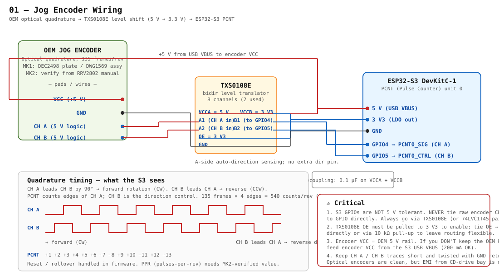

# 01 — Jog Encoder

> The OEM jog wheel rides on an **optical quadrature encoder** that emits two square waves (CH A and CH B) at 5 V logic. The ESP32-S3 is 3.3 V only, so the signals pass through a **TXS0108E** bidirectional level translator on the way to the **PCNT** (Pulse Counter) peripheral, which decodes direction + position in hardware.



---

## OEM hardware

- **Type:** optical incremental quadrature encoder
- **Resolution:** ~135 frames per revolution (MK1 known; verify the MK2 value against service manual RRV2802 — Pioneer kept it the same on every CDJ-1000 variant from what's visible in the parts catalogue, but confirm)
- **Outputs:** CH A, CH B at 5 V CMOS levels
- **Supply:** 5 V
- **MK1 part references:** DEC2498 (encoder plate), DWG1569 (jog B assembly). MK2 equivalent numbers need a service-manual lookup.

When the platter rotates forward, **CH A leads CH B by 90°**. Reverse rotation flips the lead/lag relationship. Counting edges of CH A while sampling the level of CH B gives you both displacement *and* direction. That's the standard quadrature decode — and it's exactly what the S3's PCNT peripheral does in hardware, freeing the CPU completely.

---

## Why level shifting (and why TXS0108E)

The S3's GPIO inputs are spec'd to **3.6 V absolute max**. Feeding a 5 V encoder signal into them risks injection current into the protection diodes — at best it'll latch up, at worst it kills the GPIO over time.

**TXS0108E** is the simplest pick: 8-channel bidirectional auto-direction translator, no separate direction pin. Two channels used (CH A, CH B); the other six are spare and can absorb later signals (e.g., display board ribbon taps for the v0.2 jog-centre work).

Alternatives that would work:
- **74LVC1T45** pair (one per channel) — directional but smaller, cheaper, lower latency
- **74AHCT-series buffer** powered from 3.3 V on the output side — receives 5 V on the input side, 3.3 V on the output
- **Resistor divider (5 V → 3.3 V via 1 kΩ / 1.8 kΩ)** — works mechanically but adds RC delay; fine for slow rotation, marginal for scratching/fast jog motion

TXS0108E is the safest first pick.

---

## Pin / signal table

| Signal | Origin | TXS0108E pin | ESP32-S3 GPIO | Notes |
|---|---|---|---|---|
| Encoder VCC | OEM 5 V rail or USB VBUS | — | — | 5 V supply to encoder body |
| Encoder GND | star ground | — | — | tie at PSU return |
| **CH A** | encoder output | A1 (5 V side) → B1 (3.3 V side) | **GPIO 4** | PCNT0 SIG input |
| **CH B** | encoder output | A2 (5 V side) → B2 (3.3 V side) | **GPIO 5** | PCNT0 CTRL input |
| TXS VCCA | + | + | — | tie to 5 V rail |
| TXS VCCB | + | + | — | tie to S3 3.3 V rail |
| TXS OE | + | OE | — | pull to 3.3 V (10 kΩ) to enable the buffer |
| TXS GND | + | GND | — | common ground |

Decoupling: **100 nF on VCCA** and **100 nF on VCCB**, as close as you can get to the IC. The 5 V side wants a bigger bulk cap (4.7 µF) if the encoder switching is loaded.

---

## ESP32-S3 PCNT configuration (firmware sketch)

Hardware quadrature decode in ESP-IDF:

```c
#include "driver/pulse_cnt.h"

#define JOG_A_GPIO 4
#define JOG_B_GPIO 5
#define JOG_HIGH_LIMIT  10000
#define JOG_LOW_LIMIT  -10000

static pcnt_unit_handle_t jog_unit = NULL;

void jog_pcnt_init(void) {
    pcnt_unit_config_t unit_cfg = {
        .high_limit = JOG_HIGH_LIMIT,
        .low_limit  = JOG_LOW_LIMIT,
        .flags.accum_count = true,
    };
    pcnt_new_unit(&unit_cfg, &jog_unit);

    pcnt_chan_config_t chan_a_cfg = {
        .edge_gpio_num  = JOG_A_GPIO,   // CH A → edge
        .level_gpio_num = JOG_B_GPIO,   // CH B → level (direction)
    };
    pcnt_channel_handle_t chan_a = NULL;
    pcnt_new_channel(jog_unit, &chan_a_cfg, &chan_a);

    pcnt_channel_set_edge_action(chan_a,
        PCNT_CHANNEL_EDGE_ACTION_DECREASE,   // falling edge while B low
        PCNT_CHANNEL_EDGE_ACTION_INCREASE);  // rising edge while B low

    pcnt_channel_set_level_action(chan_a,
        PCNT_CHANNEL_LEVEL_ACTION_KEEP,      // B low: don't invert
        PCNT_CHANNEL_LEVEL_ACTION_INVERSE);  // B high: invert direction

    // For 4× (full quadrature) decoding, add a second channel with
    // edge/level swapped between CH A and CH B.
    pcnt_chan_config_t chan_b_cfg = {
        .edge_gpio_num  = JOG_B_GPIO,
        .level_gpio_num = JOG_A_GPIO,
    };
    pcnt_channel_handle_t chan_b = NULL;
    pcnt_new_channel(jog_unit, &chan_b_cfg, &chan_b);
    pcnt_channel_set_edge_action(chan_b,
        PCNT_CHANNEL_EDGE_ACTION_INCREASE,
        PCNT_CHANNEL_EDGE_ACTION_DECREASE);
    pcnt_channel_set_level_action(chan_b,
        PCNT_CHANNEL_LEVEL_ACTION_KEEP,
        PCNT_CHANNEL_LEVEL_ACTION_INVERSE);

    pcnt_unit_enable(jog_unit);
    pcnt_unit_clear_count(jog_unit);
    pcnt_unit_start(jog_unit);
}

int jog_read_delta(void) {
    int now = 0;
    pcnt_unit_get_count(jog_unit, &now);
    pcnt_unit_clear_count(jog_unit);
    return now;  // signed delta since last read
}
```

The `jog_read_delta()` call is what your MIDI emitter polls every ~1 ms; the delta drives the Traktor jog MIDI CC (e.g. CC 31 / 32 with a configurable scale).

---

## Mechanical / electrical sanity checks before final assembly

1. **Verify edge cleanliness with a scope.** Optical encoders are usually clean, but bay EMI (CD drive servo, switching PSU) can put glitches on the CH A / B lines. If you see ringing, add a 100 pF ceramic from each line to GND **on the 5 V side of TXS0108E** (not the 3.3 V side — that's downstream of the buffer's slew control).
2. **Confirm direction.** Spin the platter clockwise (DJ "forward") and watch the PCNT counter. Positive count = correct. If it's negative, swap the edge actions in firmware (or swap CH A/B wiring).
3. **Slow + fast tests.** Bedroom-speed jog and full-speed cue scratch. At full scratch the encoder can output well above 10 kHz on each channel; TXS0108E handles ~1 MHz without issue.

---

## MK2-specific open items

- [ ] Read the MK2 jog encoder part number off the service manual (RRV2802) and confirm DWG1569 vs the MK2 number
- [ ] Confirm 135 PPR — Pioneer's "frames per rev" notation can mean **frames** (135) or **edges** (540 in 4× decode); reading the OEM main board's CDJ-2000-style position reporting will tell us which
- [ ] Confirm encoder VCC rail (5 V) on the OEM main↔jog ribbon; service manual schematic page will confirm
- [ ] Identify which connector / pad on the OEM jog assembly carries CH A and CH B (often labelled `JOG1` and `JOG2` on Pioneer schematics)

---

## Bill of materials

| Part | Qty | ~Cost | Notes |
|---|---|---|---|
| TXS0108E breakout (or bare IC) | 1 | $1–4 | Adafruit/SparkFun/clone breakouts have the OE pull-up done for you |
| 100 nF ceramic 0805 | 2 | <$0.10 | decoupling on VCCA and VCCB |
| 10 kΩ pull-up (if bare IC) | 1 | <$0.10 | OE → 3.3 V |
| 4.7 µF bulk cap | 1 | <$0.10 | on 5 V near TXS |
| 28 AWG twisted pair + return | ~30 cm | — | from encoder pads to TXS, twisted with GND |

The breakout-board option is the fastest path; a bare TXS0108E QSOP IC is straightforward to hand-solder if you're already laying out a custom carrier PCB.

---

## References

- ESP-IDF PCNT driver — `driver/pulse_cnt.h`. The S3's PCNT peripheral has hardware glitch filtering (`pcnt_unit_set_glitch_filter`) — set it to ~1 µs to kill any residual ringing.
- TXS0108E datasheet — Texas Instruments. Note the "weak driver" caveat: don't tie strong external pull-ups (< 10 kΩ) to the 3.3 V side, you'll fight the level translator.
- Pioneer CDJ-1000MK2 service manual (doc RRV2802) — local copy at `docs/source/CDJ1000MK2-service-manual.pdf` (gitignored). Look for sheets that reference DWX2305 MAIN and the jog ribbon.
