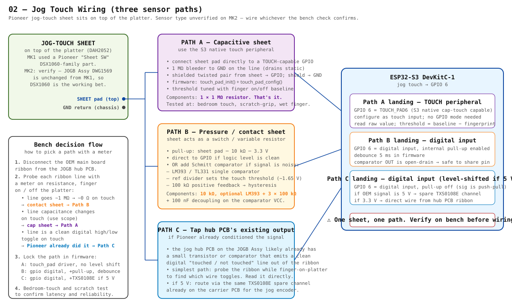

# 02 — Jog Touch

> The Pioneer jog wheel detects when a finger touches the platter — used by the OEM firmware to slow / stop playback in vinyl mode. The MK1 design used a Pioneer "Sheet SW" of the **DSX1060** family, and since the MK2 JOGB assembly (**DWG1569**) is unchanged from MK1 per the RRV2802 parts list, the same sensor is the working assumption — **but it has to be verified at the bench**, because three different wiring paths apply depending on what it actually is.



---

## Why three paths

Pioneer's "Sheet SW" naming is ambiguous: it could be a capacitive sheet (the whole platter top is one big touch pad), a pressure/contact sheet (gentle press shorts two layers), or already pre-conditioned by a small front-end on the OEM jog hub PCB that emits a clean digital "touched / not touched" line. Without the unit open and a meter on the ribbon, we don't know which.

So this doc covers all three:

| Path | What's on the platter | What we provide | S3 mode |
|---|---|---|---|
| **A** | Capacitive sheet (touch changes line capacitance) | One 1 MΩ bleeder. Nothing else. | GPIO 6 as **TOUCH_PAD6** (native cap-touch peripheral) |
| **B** | Pressure / contact sheet (touch shorts to ground) | 10 kΩ pull-up; optionally an LM393 Schmitt comparator | GPIO 6 as **digital input** with internal pull-up + debounce |
| **C** | Hub PCB already emits a clean digital line | Just route the wire (level-shift if 5 V via spare TXS0108E channel) | GPIO 6 as **digital input** |

Bench check picks one. Don't wire all three.

---

## Bench decision flow (do this before soldering anything)

1. **Disconnect** the OEM mainboard ribbon from the JOGB hub PCB. Leave the JOGB powered down for now.
2. **Probe each line on the ribbon** with a meter. Take baseline readings with the platter untouched, then with a finger on the platter:
   - Line goes **~1 MΩ → ~0 Ω** on touch → **contact/pressure sheet** → **Path B**
   - Line **capacitance changes** on touch (you'll need a scope or an LCR meter to see this — a multimeter won't pick it up) → **cap sheet** → **Path A**
   - Line is a **clean digital high/low toggle** on touch (no analog behaviour, square edges) → **Pioneer already conditioned it** → **Path C**
3. **Lock the path in firmware** per the table above.

---

## Path A — capacitive sheet (S3 native cap-touch)

The simplest of the three. The S3 has 14 native touch channels; **TOUCH_PAD6 is on GPIO 6**, which matches our v0.1 GPIO map.

### Wiring

| From | Via | To | Notes |
|---|---|---|---|
| Sheet pad | 1 × 1 MΩ to GND (bleeder, drains static) | **GPIO 6** | shielded twisted pair from sheet pad to S3; shield → GND at S3 only |
| Sheet GND return | — | star ground | as short and as wide as practical |

That's the entire BOM: one 1 MΩ resistor.

### Firmware sketch

```c
#include "driver/touch_pad.h"

#define JOG_TOUCH_PAD TOUCH_PAD_NUM6   // GPIO 6
static uint32_t touch_baseline;

void jog_touch_init(void) {
    touch_pad_init();
    touch_pad_config(JOG_TOUCH_PAD);
    touch_pad_set_voltage(TOUCH_HVOLT_2V7, TOUCH_LVOLT_0V5, TOUCH_HVOLT_ATTEN_1V);
    touch_pad_fsm_start();

    // Settle, then capture baseline at boot (no finger touching platter)
    vTaskDelay(pdMS_TO_TICKS(50));
    touch_pad_read_raw_data(JOG_TOUCH_PAD, &touch_baseline);
}

bool jog_is_touched(void) {
    uint32_t now;
    touch_pad_read_raw_data(JOG_TOUCH_PAD, &now);
    // Cap touch DROPS the raw count when a finger lands
    return now < (touch_baseline * 85 / 100);  // 15 % drop = touch
}
```

The 15 % threshold is a starting point; tune against real fingers + real chassis grounding.

---

## Path B — pressure / contact sheet (comparator front-end)

If the sheet is a contact switch, the line floats high and shorts to ground (or vice versa) on touch.

### Simple version (no comparator)

| From | Via | To | Notes |
|---|---|---|---|
| Sheet pad | 10 kΩ pull-up to 3.3 V | **GPIO 6** | digital input, internal pull-up off (external one drives it) |
| Sheet GND return | — | star ground | |

S3 configuration: `gpio_set_direction(6, GPIO_MODE_INPUT)`, no internal pull. Read the level; debounce 5 ms in firmware.

### With Schmitt comparator (cleaner if the contact is bouncy or marginal)

| Part | Role |
|---|---|
| LM393 or TL331 | single-channel open-drain comparator |
| 10 kΩ pull-up on sheet line | provides high level when untouched |
| Voltage divider 2× 10 kΩ from 3.3 V | sets ~1.65 V reference into V+ |
| 100 kΩ positive feedback | hysteresis (V+ ↔ V_out) so the contact doesn't chatter |
| 10 kΩ open-drain pull-up to 3.3 V on V_out | needed because LM393 is open-drain |
| 100 nF on the comparator VCC | decoupling |

V_out → **GPIO 6**, digital input, internal pull-up *off* (external 10 kΩ is the pull-up).

```c
#include "driver/gpio.h"

#define JOG_TOUCH_GPIO 6

void jog_touch_init(void) {
    gpio_config_t cfg = {
        .pin_bit_mask = (1ULL << JOG_TOUCH_GPIO),
        .mode = GPIO_MODE_INPUT,
        .pull_up_en = GPIO_PULLUP_DISABLE,
        .pull_down_en = GPIO_PULLDOWN_DISABLE,
        .intr_type = GPIO_INTR_DISABLE,
    };
    gpio_config(&cfg);
}

bool jog_is_touched(void) {
    // active LOW (sheet shorts to GND)
    return gpio_get_level(JOG_TOUCH_GPIO) == 0;
}
```

Debouncing in the polling loop: count 5 ms of stable state before toggling the reported value.

---

## Path C — tap the hub PCB's existing output

The OEM jog hub PCB on the JOGB assembly almost certainly has small components beyond the encoder and the vinyl LED — Pioneer often drops a transistor or comparator right next to the sensor to clean up the signal before it hits the main-board ribbon.

If a ribbon line already toggles cleanly between high and low on touch (Step 2 of the bench decision flow), there's nothing for us to add: route that line straight to **GPIO 6** as a digital input, level-shifted if it's 5 V (use a **spare TXS0108E channel** — we already have 6 of 8 unused on the carrier PCB after the jog encoder takes CH 1 + 2).

### Wiring (5 V signal case)

| From | Via | To | Notes |
|---|---|---|---|
| Hub PCB ribbon line carrying touch state | TXS0108E channel 3 (A3 → B3) | **GPIO 6** | reuse the same TXS used for jog encoder CH A/B |
| GND | — | star ground | |

### Wiring (3.3 V signal case)

Direct wire. No TXS channel needed. Just GPIO 6 as digital input.

---

## Which path will it actually be?

Empirical guess based on Lee Smith's MK1 article and the spectran CDJ-100S adapter (both of which tapped the existing OEM touch signal rather than rebuilding the front-end): **Path C is the most likely outcome**. Pioneer's design rationale was to keep noise off the long ribbon to the mainboard MCU, so they conditioned the signal at the hub.

But the only way to know for sure is the meter test. Until you have the unit open, all three paths are documented so the wiring decision can be made and locked in a single bench session.

---

## MK2-specific open items

- [ ] Confirm the touch sheet is the same DSX1060-family part as MK1 (working assumption from DWG1569 being unchanged)
- [ ] Identify the touch line on the OEM jog hub ribbon connector
- [ ] Decide path (A / B / C) after the meter test
- [ ] If Path C: confirm whether the signal is 5 V or 3.3 V; route via TXS0108E channel 3 if 5 V

---

## Bill of materials (Path-dependent)

| Path | Parts | Total ~$ |
|---|---|---|
| A | 1 × 1 MΩ resistor, shielded twisted pair | <$1 |
| B (simple) | 1 × 10 kΩ resistor, debounced in firmware | <$1 |
| B (Schmitt) | LM393 (or TL331), 4 × 10 kΩ + 1 × 100 kΩ + 100 nF | ~$1 |
| C | nothing extra if 3.3 V; otherwise borrow 1 channel of the existing TXS0108E | $0 |

---

## References

- Pioneer CDJ-1000MK2 service manual (RRV2802) — local copy at `docs/source/CDJ1000MK2-service-manual.pdf` (gitignored). JOGB Assy parts list at p.288; cross-reference DSX1060 family parts under the Sheet SW catalog.
- Lee Smith / DJLegionUK MK1 Teensy build — used the OEM hub PCB output directly (Path C analogue).
- spectran CDJ-100S-MIDI-Adapter — `Schematics/Connection_scheme.pdf` shows the CT (Cue Touch) line tap on the CDJ-100S, which is the same architectural pattern.
- ESP-IDF `driver/touch_pad.h` for Path A; `driver/gpio.h` for B and C.
