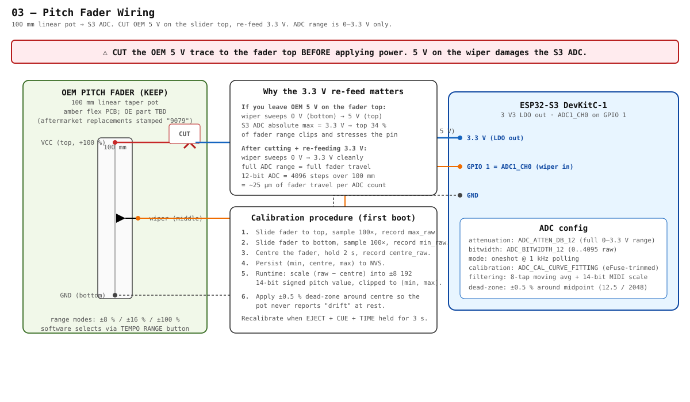

# 03 — Pitch Fader

> The OEM 100 mm linear pitch fader gets its wiper signal sampled by the ESP32-S3 ADC. The single most important step in this subsystem is **cutting the OEM 5 V feed to the fader top and re-feeding it from the S3's 3.3 V rail**. Skipping that destroys the S3 ADC pin within seconds.



---

## ⚠ Cut the 5 V before powering up

The S3 ADC absolute-maximum input voltage is **3.3 V** (technically `V_DD + 0.3 V`). The OEM fader divides its top-rail voltage from 0 V (bottom) to V_top (top). With Pioneer's stock wiring, V_top is **5 V**, so the wiper sweeps 0 V → 5 V. Anything above 3.3 V clips the protection diodes on the S3 GPIO, pulls injection current into the supply rail, and over hours-to-days kills the pin.

The fix is the same one spectran's CDJ-100S adapter documented in step 6 of their conversion: **physically cut the trace carrying 5 V to the fader-top terminal, and re-feed it from 3.3 V instead**. Once that's done, the wiper sweeps 0 V → 3.3 V and lands cleanly across the full ADC range with no scaling needed.

The fader pot itself is a simple resistive element — feeding it 3.3 V instead of 5 V changes nothing about its behaviour or the OEM tactile feel; only the output voltage scales.

---

## Wiring

| OEM fader terminal | OEM wiring | v0.1 wiring | Notes |
|---|---|---|---|
| Top (+100 %) | 5 V from OEM PSU | **cut the 5 V trace** · re-feed from S3 **3.3 V** rail | this is the safety-critical change |
| Wiper (centre, ±0 %) | to OEM mainboard ADC | to **GPIO 1 (ADC1_CH0)** | 12-bit ADC, ATTEN_DB_12 |
| Bottom (−100 %) | GND | GND (star ground) | unchanged |

That's it. Three wires.

### Where to make the cut

The OEM 5 V trace runs across the small amber flex PCB the slider is mounted on. Two practical ways:

1. **Scalpel + magnifier**: nick the trace between the connector and the pot top terminal, then bridge a 3.3 V wire to the pot side of the cut. Reversible if you ever want to put the OEM mainboard back.
2. **Lift the pot terminal**: desolder the pot top terminal pad, solder a fresh wire to it, run that wire back to the S3 3.3 V pad. Same effect, no trace damage. This is the cleaner option if you're handy with a hot air station.

Either way, verify with a meter (3.3 V at the pot top, 0 V at the bottom, sweep at the wiper) **before** the S3 is connected to the wiper.

---

## ADC configuration (ESP-IDF)

```c
#include "esp_adc/adc_oneshot.h"
#include "esp_adc/adc_cali.h"
#include "esp_adc/adc_cali_scheme.h"

#define PITCH_ADC_UNIT     ADC_UNIT_1
#define PITCH_ADC_CHANNEL  ADC_CHANNEL_0   // GPIO 1
#define PITCH_ATTEN        ADC_ATTEN_DB_12 // full 0–3.3 V

static adc_oneshot_unit_handle_t pitch_handle;
static adc_cali_handle_t pitch_cali;

void pitch_init(void) {
    adc_oneshot_unit_init_cfg_t unit_cfg = {
        .unit_id = PITCH_ADC_UNIT,
    };
    adc_oneshot_new_unit(&unit_cfg, &pitch_handle);

    adc_oneshot_chan_cfg_t ch_cfg = {
        .bitwidth = ADC_BITWIDTH_12,
        .atten    = PITCH_ATTEN,
    };
    adc_oneshot_config_channel(pitch_handle, PITCH_ADC_CHANNEL, &ch_cfg);

    // eFuse-based curve-fitting calibration (S3 supports this scheme natively)
    adc_cali_curve_fitting_config_t cali_cfg = {
        .unit_id  = PITCH_ADC_UNIT,
        .atten    = PITCH_ATTEN,
        .bitwidth = ADC_BITWIDTH_12,
    };
    adc_cali_create_scheme_curve_fitting(&cali_cfg, &pitch_cali);
}

int pitch_read_raw(void) {
    int raw;
    adc_oneshot_read(pitch_handle, PITCH_ADC_CHANNEL, &raw);
    return raw;  // 0..4095
}

int pitch_read_mv(void) {
    int raw = pitch_read_raw();
    int mv  = 0;
    adc_cali_raw_to_voltage(pitch_cali, raw, &mv);
    return mv;  // 0..3300
}
```

Poll at **1 kHz** from a 1 ms task. Apply an 8-tap moving average — kills the ADC's natural ±2 LSB jitter without adding noticeable latency.

---

## Calibration

The first boot stores user-specific calibration to NVS so the fader reports clean (−8192, +8192) 14-bit MIDI values regardless of small variations in pot end-stops or your 3.3 V rail.

1. **Top**: slide fully up, sample 100×, record `max_raw`.
2. **Bottom**: slide fully down, sample 100×, record `min_raw`.
3. **Centre**: park at the detent, hold 2 s, record `centre_raw`.
4. **Persist** `(min_raw, centre_raw, max_raw)` to NVS under `pitch_cal/`.
5. **Runtime scale**: `pitch_14bit = clamp(((raw − centre_raw) × 8192) / (max_raw − centre_raw), −8192, +8192)`.
6. **Dead-zone**: any `|raw − centre_raw| < 12` (≈ 0.5 %) reports 0. Stops the pot from drifting 1–2 LSB at rest.

Re-trigger calibration by holding **EJECT + CUE + TIME** for 3 s.

---

## MIDI mapping

Traktor expects pitch as either:
- **Pitchbend** (14-bit signed) — best resolution, dedicated channel-message
- **MIDI CC pair** (MSB + LSB) — also 14-bit, e.g. CC 1 + CC 33

Either works. Pitchbend is slightly simpler on the firmware side and consumes one less CC slot. Map the pitch range (±8/±16/±100 %) on the **Traktor side** through the TSI file — keep firmware emitting full ±8192 range regardless of selected range mode. This way the TEMPO RANGE button just toggles a TSI mapping, not a firmware mode.

If Traktor's pitch-bend resolution feels coarse, switch to the 14-bit CC pair (CC 1 / CC 33 is the common pairing) and configure Traktor's MIDI input as `14-bit CC`.

---

## Real-world sanity checks

1. **Centre detent**: with the fader at the detent, the reported value should sit at 0 ± dead-zone forever. If it drifts, the calibration `centre_raw` is wrong — re-run it.
2. **End-stop linearity**: sweep slowly top-to-bottom while logging values. The curve should be straight. A bend at the top means you forgot to cut the 5 V trace (clipping at ~3.3 V × 2048 = 2048 raw counts).
3. **Tap test**: tap the fader body. The reported value should not jump. If it does, the ground return isn't tight enough — shorten the GND wire and use a star tie.
4. **MIDI smoothness**: connect to Traktor and pitch up a track. The pitch should slew continuously, no zipper noise. Zipper means the 8-tap average isn't running, or you're sampling slower than 1 kHz.

---

## MK2-specific open items

- [ ] Confirm OEM fader part number from RRV2802 (parts list lookup)
- [ ] Identify the exact ribbon line carrying the 5 V to the pot top on the MK2 mainboard side, so the cut location is unambiguous
- [ ] Confirm the fader uses a linear taper (Pioneer's standard); a log taper would need software linearisation
- [ ] Check whether the OEM fader has internal centre-detent contacts — some Pioneer models break the contact for the firmware to register centre; if so, that's an extra signal we can read on a spare GPIO

---

## Bill of materials

| Part | Qty | ~Cost | Notes |
|---|---|---|---|
| Hookup wire (28 AWG) | ~30 cm | <$0.10 | three wires from fader to S3 |
| Solder bridge / fresh pad to pot top | — | $0 | hand-work; no extra parts |
| Decoupling cap 100 nF on the S3 3.3 V near the fader (optional) | 1 | <$0.05 | helps if the fader is far from the S3 |

The whole subsystem costs effectively zero in additional parts. The cost is precision soldering / trace-cutting.

---

## References

- [spectran/CDJ-100S-MIDI-Adapter](https://github.com/spectran/CDJ-100S-MIDI-Adapter) — `Connection_scheme.pdf` and the step-by-step in `Instructions.pdf` step 6 documents this 3.3 V re-feed; same lesson, different chassis.
- ESP-IDF `esp_adc/adc_oneshot.h` + `esp_adc/adc_cali.h` (calibration via curve-fitting scheme on S3).
- Pioneer CDJ-1000MK2 service manual (RRV2802) — local copy at `docs/source/CDJ1000MK2-service-manual.pdf` (gitignored). Look for the fader part number under the "Top Panel" section of the parts list.
