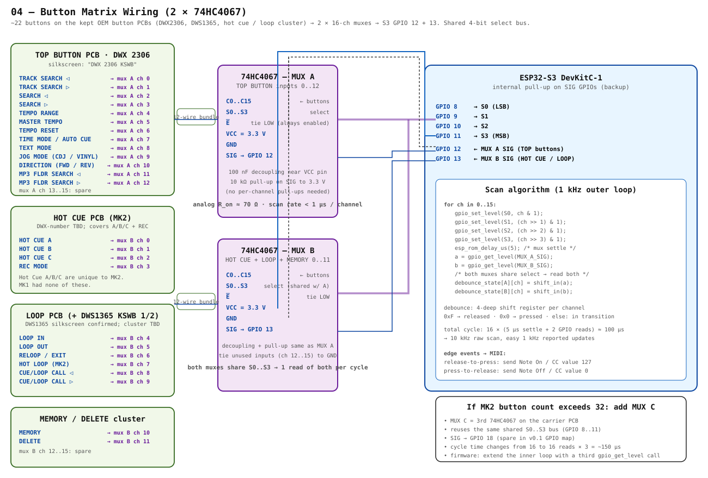

# 04 — Button Matrix (2 × 74HC4067)

> All ~22 of the kept OEM buttons (TRACK SEARCH / SEARCH / TEMPO / mode keys / HOT CUE A·B·C / LOOP IN-OUT-RELOOP-HOT / MEMORY / DELETE / MP3 FLDR ◁▷) get scanned through two **74HC4067** 16-channel multiplexers on the carrier PCB. Both muxes share the same 4-bit select bus (GPIO 8..11). Each has its own SIG output (GPIO 12 for MUX A, GPIO 13 for MUX B). 3.3 V logic, no level shifting.



---

## Why this architecture

- The OEM mainboard matrix-scans these buttons over a Pioneer-custom row/column protocol on a multi-wire ribbon. With the OEM board gone, we get to redesign the read path.
- The S3 has plenty of GPIOs, but tying ~22 buttons to direct GPIO would burn pins we want for jog, fader, LEDs, and discrete switches.
- A 74HC4067 16:1 mux trades one external IC + 5 GPIOs (4 select + 1 SIG) for 16 button inputs. Two of them = 32 button slots from 6 GPIOs.
- Sharing the select bus across both muxes is the standard trick: when you set S0..S3 = `n`, both muxes route input `n` to their respective SIG simultaneously. One GPIO-write phase, two GPIO-reads.

---

## Channel assignment

| MUX | Channel | Button | Source PCB |
|---|---|---|---|
| A | 0 | TRACK SEARCH ◁ | DWX2306 KSWB (top button flex) |
| A | 1 | TRACK SEARCH ▷ | DWX2306 |
| A | 2 | SEARCH ◁ | DWX2306 |
| A | 3 | SEARCH ▷ | DWX2306 |
| A | 4 | TEMPO RANGE | DWX2306 |
| A | 5 | MASTER TEMPO | DWX2306 |
| A | 6 | TEMPO RESET | DWX2306 |
| A | 7 | TIME MODE / AUTO CUE | DWX2306 |
| A | 8 | TEXT MODE | DWX2306 |
| A | 9 | JOG MODE (CDJ / VINYL) | DWX2306 |
| A | 10 | DIRECTION (FWD / REV) | DWX2306 |
| A | 11 | MP3 FOLDER SEARCH ◁ | DWX2306 |
| A | 12 | MP3 FOLDER SEARCH ▷ | DWX2306 |
| A | 13..15 | **spare** | tie to GND on the carrier PCB |
| B | 0 | HOT CUE A | hot cue PCB (MK2-only) |
| B | 1 | HOT CUE B | hot cue PCB |
| B | 2 | HOT CUE C | hot cue PCB |
| B | 3 | REC MODE | hot cue PCB |
| B | 4 | LOOP IN | loop PCB |
| B | 5 | LOOP OUT | loop PCB |
| B | 6 | RELOOP / EXIT | loop PCB |
| B | 7 | HOT LOOP (MK2-only) | loop PCB |
| B | 8 | CUE / LOOP CALL ◁ | loop PCB |
| B | 9 | CUE / LOOP CALL ▷ | loop PCB |
| B | 10 | MEMORY | memory cluster (small DWS1365 or its sibling) |
| B | 11 | DELETE | memory cluster |
| B | 12..15 | **spare** | tie to GND |

That's 13 buttons on MUX A and 12 on MUX B (= 25). The architecture earlier said ~20; the count goes up once you actually enumerate everything MK2 has. If a final bench-verified inventory pushes either side beyond 16, drop in **MUX C** (see "Escape hatch" below).

**Tie unused inputs to GND.** Floating CMOS inputs on a 74HC4067 can pick up noise even when not selected — when you scan that channel you may read a phantom press.

---

## 74HC4067 pinout (quick reference)

| Pin | Function |
|---|---|
| 1..8, 16..24 | C0..C15 (16 analog/digital channels) |
| 9 | C7 (yes, channel-7 input lives mid-pinout) — check the datasheet you have on the bench |
| 10..13 | S0, S1, S2, S3 (channel select; binary count) |
| 14 | E̅ (enable, active low) — **tie to GND on the carrier PCB** |
| 15 | SIG (common pole) |
| Power | VCC + GND on the package edges |

Exact pin numbering varies between the SOIC and TSSOP packages — match the datasheet for the part you actually buy. Don't trust generic "74HC4067 pinout" diagrams without cross-checking the manufacturer's PDF.

---

## Wiring

| From | Via | To | Notes |
|---|---|---|---|
| each button (one terminal) | OEM PCB ribbon → carrier PCB | MUX A or MUX B input pin | other terminal of each button → GND |
| MUX A SIG | 10 kΩ pull-up to 3.3 V | **GPIO 12** | S3 internal pull-up also enabled as belt-and-braces |
| MUX B SIG | 10 kΩ pull-up to 3.3 V | **GPIO 13** | same |
| Both muxes S0 | — | **GPIO 8** | LSB of channel select |
| Both muxes S1 | — | **GPIO 9** | |
| Both muxes S2 | — | **GPIO 10** | |
| Both muxes S3 | — | **GPIO 11** | MSB |
| Both muxes E̅ | — | GND | always enabled |
| VCC | — | 3.3 V | + 100 nF decoupling per IC |
| GND | — | star ground | |

**Active LOW**: a pressed button shorts its mux channel input to GND. SIG reads LOW → "pressed". Released = floating → pull-up holds SIG HIGH → "released".

---

## Scan algorithm (ESP-IDF)

The outer loop runs at 1 kHz (every 1 ms). Each outer iteration scans all 16 channels in ~100 µs of CPU, so you have plenty of headroom for the rest of the firmware.

```c
#include "driver/gpio.h"
#include "rom/ets_sys.h"

#define MUX_S0_GPIO   8
#define MUX_S1_GPIO   9
#define MUX_S2_GPIO   10
#define MUX_S3_GPIO   11
#define MUX_A_SIG     12
#define MUX_B_SIG     13

#define MUX_SETTLE_US 5

static uint8_t shift_a[16];   // 8-bit shift register per channel, debounce
static uint8_t shift_b[16];
static uint16_t state_a;      // 1-bit per channel: 1 = pressed
static uint16_t state_b;

void mux_init(void) {
    gpio_config_t sel_cfg = {
        .pin_bit_mask = (1ULL << MUX_S0_GPIO) |
                        (1ULL << MUX_S1_GPIO) |
                        (1ULL << MUX_S2_GPIO) |
                        (1ULL << MUX_S3_GPIO),
        .mode = GPIO_MODE_OUTPUT,
    };
    gpio_config(&sel_cfg);

    gpio_config_t sig_cfg = {
        .pin_bit_mask = (1ULL << MUX_A_SIG) | (1ULL << MUX_B_SIG),
        .mode         = GPIO_MODE_INPUT,
        .pull_up_en   = GPIO_PULLUP_ENABLE,
    };
    gpio_config(&sig_cfg);
}

void mux_scan_once(uint16_t *out_a, uint16_t *out_b) {
    uint16_t a = 0, b = 0;
    for (int ch = 0; ch < 16; ++ch) {
        gpio_set_level(MUX_S0_GPIO, (ch >> 0) & 1);
        gpio_set_level(MUX_S1_GPIO, (ch >> 1) & 1);
        gpio_set_level(MUX_S2_GPIO, (ch >> 2) & 1);
        gpio_set_level(MUX_S3_GPIO, (ch >> 3) & 1);
        ets_delay_us(MUX_SETTLE_US);

        // Active LOW: shift in the inverted level (0 = release, 1 = press)
        shift_a[ch] = (shift_a[ch] << 1) | (gpio_get_level(MUX_A_SIG) ^ 1);
        shift_b[ch] = (shift_b[ch] << 1) | (gpio_get_level(MUX_B_SIG) ^ 1);

        if (shift_a[ch] == 0xFF) a |= (1 << ch);   // 8 stable samples → pressed
        if (shift_b[ch] == 0xFF) b |= (1 << ch);
        // Note: state stays "released" until we see 8 zero samples too.
        // Implementation: if shift_a[ch] == 0x00, clear the bit explicitly.
        if (shift_a[ch] == 0x00) a &= ~(1 << ch);
        if (shift_b[ch] == 0x00) b &= ~(1 << ch);
    }
    *out_a = a;
    *out_b = b;
}
```

Wrap that in a 1 ms FreeRTOS task. Diff each new state against the previous to emit `note_on` / `note_off` events into the USB-MIDI tx queue.

### Debouncing details

The 8-bit shift register gives you **8 ms of debounce** at the 1 kHz scan rate (each sample is 1 ms apart). That kills mechanical bounce on Pioneer's tact switches cleanly without adding human-perceptible latency. If you want sharper response on hot cues, shorten to a 4-bit shift register (= 4 ms debounce) for those channels only.

---

## Escape hatch — MUX C if the count exceeds 32

If a final bench-verified count of MK2 buttons pushes either side beyond its 16-channel mux, add a third **74HC4067** on the carrier PCB.

- Reuses the same shared S0..S3 bus (GPIO 8..11), so no new select wires.
- SIG → **GPIO 18** (held as spare in the v0.1 GPIO map for exactly this).
- Firmware: extend the inner loop with a third `gpio_get_level(MUX_C_SIG)` and a third shift array.
- Cycle time: ~100 µs → ~150 µs. Still well under the 1 ms budget.

---

## MK2-specific open items

- [ ] Final button count from the MK2 bench-open inventory (resolves whether MUX C is needed)
- [ ] Confirm each kept button PCB's connector pin order (which OEM wire = which switch) → translate to MUX channel
- [ ] Verify whether the OEM matrix scan uses any LEDs co-located in the same matrix (some Pioneer designs do); if so, those LED drives have to be split out for separate MOSFET handling
- [ ] Decide whether to MIDI-map `DIRECTION` and `JOG MODE` as toggle latch (firmware) or pass-through (Traktor sees raw on/off and latches in TSI)

---

## Bill of materials

| Part | Qty | ~Cost | Notes |
|---|---|---|---|
| 74HC4067 SOIC-24 | 2 | $0.50–1.00 ea | mux A + mux B; add 1 more for MUX C if needed |
| 100 nF ceramic 0805 | 2 | <$0.10 | decoupling per IC |
| 10 kΩ resistor 0603 | 2 | <$0.10 | SIG pull-ups |
| pin headers / FFC connector | — | <$2 | depending on how you mate the OEM ribbons to the carrier PCB |
| ribbon wire to OEM PCBs | varies | — | length depends on chassis routing |

Total mux subsystem: under $5 in parts.

---

## References

- 74HC4067 datasheet — Nexperia / TI / NXP all sell drop-in equivalents; pick the cheapest in your distributor cart.
- Pioneer CDJ-1000MK2 service manual (RRV2802) — local copy at `docs/source/CDJ1000MK2-service-manual.pdf`. Use the "Top Panel" exploded view to cross-reference each kept button PCB's connector designator (`CN8xx` series) to the silkscreen on the boards.
- Subsystem [`00-board-map.md`](./00-board-map.md) for the MK2 board catalog (DWX2306, DWS1365, hot cue PCB, etc.).
