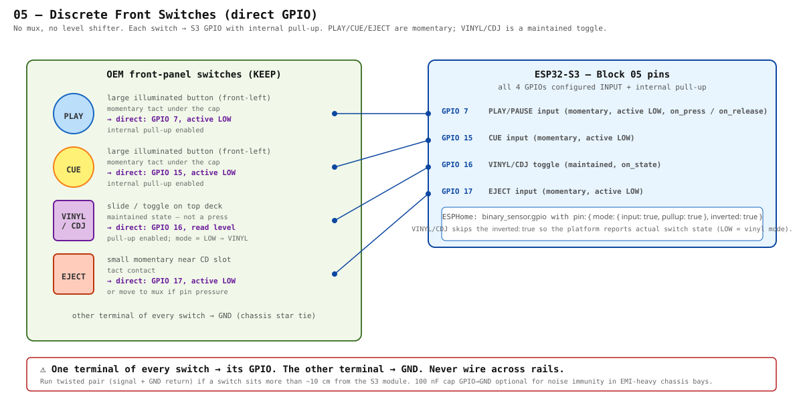

# 05 — Discrete Front Switches

> Four switches on the front of the deck don't fit cleanly in the mux scheme: **PLAY/PAUSE**, **CUE**, **VINYL/CDJ**, **EJECT**. They get direct S3 GPIOs with internal pull-ups. Three are momentary tact under illuminated caps; one (VINYL/CDJ) is a maintained slide/toggle.



---

## Why these aren't on the mux

- **Latency**: PLAY and CUE are the highest-touch buttons on the deck. Skipping the 16-channel scan window (~80 µs round-trip on our 1 kHz scan) gives them deterministic single-µs response.
- **Pin economics**: we have plenty of GPIOs once mux + display + LEDs + jog are wired. Spending four on the most-pressed switches is the right trade.
- **Switch type mismatch**: VINYL/CDJ is a *maintained* toggle, not a momentary tact. The mux scan code emits press / release edge events; a slide switch wants level reads. Easier to keep it on a dedicated GPIO.

## Wiring

| Switch | Type | S3 GPIO | Active level | Pull-up | Notes |
|---|---|---|---|---|---|
| PLAY / PAUSE | momentary tact (under large illuminated cap) | **GPIO 7** | LOW | S3 internal | other terminal → GND |
| CUE | momentary tact (under large illuminated cap) | **GPIO 15** | LOW | S3 internal | other terminal → GND |
| VINYL / CDJ | maintained slide / toggle | **GPIO 16** | LOW = VINYL mode | S3 internal | read level, not edge |
| EJECT | momentary tact (small button by CD slot) | **GPIO 17** | LOW | S3 internal | other terminal → GND |

Every signal wire is a single-conductor run from the switch to the S3 carrier PCB. Run twisted pair (signal + GND return) if the path is longer than ~10 cm or passes through a noisy bay. A 100 nF ceramic GPIO→GND at the S3 footprint is optional belt-and-braces if you see false triggers under heavy switching elsewhere on the bus.

## YAML (matches `firmware/cdj1000.yaml`)

```yaml
binary_sensor:
  - platform: gpio
    name: "PLAY/PAUSE"
    pin:
      number: GPIO7
      mode: { input: true, pullup: true }
      inverted: true          # active LOW
    on_press:
      - lambda: 'id(usb_midi_dev).send_note_on(0, 60, 127);'
    on_release:
      - lambda: 'id(usb_midi_dev).send_note_off(0, 60);'

  - platform: gpio
    name: "CUE"
    pin:
      number: GPIO15
      mode: { input: true, pullup: true }
      inverted: true
    on_press:
      - lambda: 'id(usb_midi_dev).send_note_on(0, 61, 127);'
    on_release:
      - lambda: 'id(usb_midi_dev).send_note_off(0, 61);'

  - platform: gpio
    name: "VINYL/CDJ Switch"
    pin:
      number: GPIO16
      mode: { input: true, pullup: true }
      # NOT inverted — we want the actual switch state
    on_state:
      - lambda: |-
          // x = true when GPIO is HIGH (CDJ mode), false when LOW (VINYL).
          // Invert here if your slide direction labels read the other way.
          id(usb_midi_dev).send_cc(0, 62, x ? 0 : 127);
          id(vinyl_light).turn_on();   // follows mode

  - platform: gpio
    name: "EJECT"
    pin:
      number: GPIO17
      mode: { input: true, pullup: true }
      inverted: true
    on_press:
      - lambda: 'id(usb_midi_dev).send_note_on(0, 63, 127);'
    on_release:
      - lambda: 'id(usb_midi_dev).send_note_off(0, 63);'
```

ESPHome handles debounce internally (default 50 ms) on the `binary_sensor.gpio` platform; if PLAY/CUE feel sluggish, drop it:

```yaml
    filters:
      - delayed_on_off: 5ms
```

## MK2-specific open items

- [ ] Confirm the **VINYL/CDJ slide direction** matches the `LOW = VINYL` assumption above; flip the lambda branch if not.
- [ ] Verify whether the OEM PLAY and CUE caps have any extra contact under them (some Pioneer designs have a separate "lit" feedback line — if present, that's a sensed input, not a controlled output).
- [ ] If the chassis routing puts EJECT on a long enough wire that it picks up noise, move it onto MUX A channel 13 (spare) and free GPIO 17 for future use.

## Bill of materials

| Part | Qty | Notes |
|---|---|---|
| Hookup wire (28 AWG) | ~80 cm | 4 signal wires from the switches to the carrier PCB |
| Optional 100 nF ceramic 0603 GPIO→GND | 0–4 | Only if you see false triggers; usually unneeded |

Effectively zero parts cost. The subsystem is wire + pull-ups, where the pull-ups live inside the S3.
