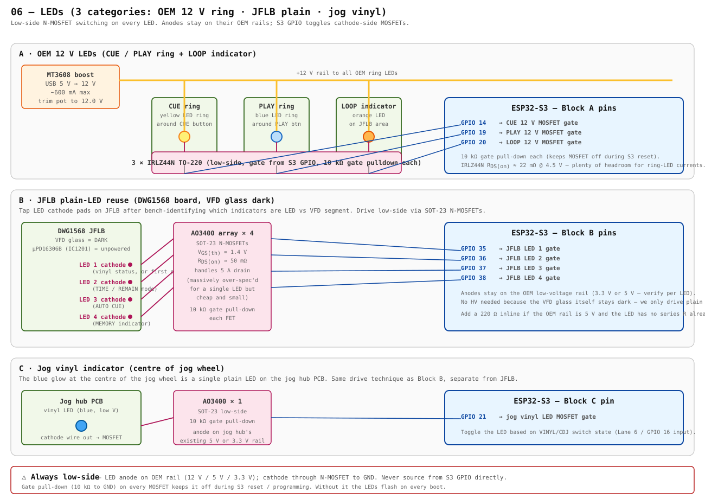

# 06 — LEDs

> Three categories with the same low-side N-MOSFET pattern but different MOSFET sizing. **Anodes stay on the OEM rail** (12 V for the CUE/PLAY/LOOP ring lights, low-V for the JFLB plain indicators and the jog vinyl LED). **Cathodes** route to S3 GPIO via N-MOSFETs. The S3 never sources LED current directly.



---

## Block A — OEM 12 V ring LEDs (CUE / PLAY / LOOP)

The OEM unit drives these from a +12 V rail through transistors on the mainboard. With the mainboard gone, we provide our own 12 V from a small **MT3608** boost off USB-VBUS (see [`09-power.md`](./09-power.md) — coming) and switch each ring with an **IRLZ44N**.

| LED string | Anode | Cathode (low-side switch) | S3 GPIO |
|---|---|---|---|
| CUE ring | +12 V rail | IRLZ44N drain → GND when on | **GPIO 14** → IRLZ44N gate |
| PLAY ring | +12 V rail | IRLZ44N drain → GND when on | **GPIO 19** → IRLZ44N gate |
| LOOP indicator | +12 V rail | IRLZ44N drain → GND when on | **GPIO 20** → IRLZ44N gate |

Each MOSFET:
- Gate pull-down: **10 kΩ to GND** (keeps the FET off during S3 reset / programming so the rings don't flash on every boot)
- No gate resistor needed — switching speed is fast enough at sub-kHz; if you ever PWM these for dimming, add a 100 Ω series gate to soften edges
- Source → star ground
- Drain → LED cathode side

**Sizing**: IRLZ44N at V_GS = 3.3 V is well within its linear region (R_DS(on) ≈ 22 mΩ @ 4.5 V, slightly higher at 3.3 V but still under 50 mΩ). Even a 500 mA ring draws < 12 mW dissipation in the FET. Massively over-spec'd, deliberately — they're $0.20 each and you don't want to be the person who undersized a low-side switch on the most-visible part of the deck.

---

## Block B — JFLB plain LEDs (display-board indicators, VFD glass dark)

JFLB carries a handful of plain LEDs alongside the VFD glass. The blue "vinyl" status, the TIME/REMAIN mode label, AUTO CUE, MEMORY, TEMPO RANGE — at least some of those are discrete LEDs, not VFD segments. With the VFD glass left dark in v0.1, we still get those indicators by tapping the LED cathode pads.

| LED | Anode rail | Switch | S3 GPIO |
|---|---|---|---|
| JFLB LED 1 (vinyl status or equivalent) | OEM 3.3 V / 5 V on JFLB | AO3400 SOT-23 | **GPIO 35** |
| JFLB LED 2 (TIME / REMAIN) | OEM rail | AO3400 | **GPIO 36** |
| JFLB LED 3 (AUTO CUE) | OEM rail | AO3400 | **GPIO 37** |
| JFLB LED 4 (MEMORY) | OEM rail | AO3400 | **GPIO 38** |

**AO3400 chosen** over IRLZ44N here because:
- Currents are tiny (< 20 mA per LED) — IRLZ44N is wasted package
- SOT-23 footprint takes ~1/10 the board area
- Same gate-threshold story — fully on at 3.3 V V_GS
- ~$0.05 each

**Identification step** (Lane 5 of the master wiring map): when the unit is open, trace each illuminated indicator on JFLB. VFD segments are addressed by the µPD16306B serial bus and need HV — skip those. Plain LEDs have a discrete cathode pad you can tap. The blue glow is the obvious one (VFD orange/green ≠ blue). Continuity-meter from the suspected cathode pad to the µPD16306B output pins; if it goes through the IC, it's a VFD segment (skip). If it goes to a discrete transistor or directly out to the connector, it's a plain LED (target it).

**Series resistors**: if the OEM design already includes a series R between the rail and the LED anode, you don't need to add one. If not, add 220 Ω inline (5 V rail) or 100 Ω (3.3 V rail) to bring the current to a sane ~10 mA.

---

## Block C — Jog vinyl indicator

The single blue LED at the centre of the jog wheel (visible through the platter cutout). Lives on the jog hub PCB, separate from JFLB.

| LED | Anode rail | Switch | S3 GPIO |
|---|---|---|---|
| Jog vinyl LED | OEM 5 V or 3.3 V on jog hub | AO3400 SOT-23 | **GPIO 21** |

Wiring is identical to Block B. State follows the VINYL/CDJ switch on **GPIO 16** (Lane 6): vinyl mode on → LED on, CDJ mode → LED off. Optionally pulse the LED at 1 Hz when "touch active" to confirm the jog touch is working — purely a UX thing.

---

## Firmware sketch (all three blocks)

Generic LED handle, since all three categories drive the same way:

```c
#include "driver/gpio.h"

typedef struct {
    int gpio;
    bool   active_high;  // true for low-side N-MOSFET driven from S3 GPIO HIGH
} led_t;

static const led_t leds[] = {
    [LED_CUE]      = { .gpio = 14, .active_high = true },
    [LED_PLAY]     = { .gpio = 19, .active_high = true },
    [LED_LOOP]     = { .gpio = 20, .active_high = true },
    [LED_VINYL]    = { .gpio = 21, .active_high = true },
    [LED_JFLB_1]   = { .gpio = 35, .active_high = true },
    [LED_JFLB_2]   = { .gpio = 36, .active_high = true },
    [LED_JFLB_3]   = { .gpio = 37, .active_high = true },
    [LED_JFLB_4]   = { .gpio = 38, .active_high = true },
};

void leds_init(void) {
    uint64_t mask = 0;
    for (int i = 0; i < sizeof(leds) / sizeof(*leds); ++i)
        mask |= (1ULL << leds[i].gpio);
    gpio_config_t cfg = {
        .pin_bit_mask = mask,
        .mode = GPIO_MODE_OUTPUT,
    };
    gpio_config(&cfg);
    // All off at boot (gate pull-downs already do this, but be explicit)
    for (int i = 0; i < sizeof(leds) / sizeof(*leds); ++i)
        gpio_set_level(leds[i].gpio, 0);
}

void led_set(int id, bool on) {
    gpio_set_level(leds[id].gpio, on == leds[id].active_high);
}
```

For PWM dimming on the CUE/PLAY rings (some users want a soft fade rather than hard on/off), swap the GPIO output for `mcpwm` or `ledc` on those three pins — both peripherals are fine at sub-kHz LED frequencies.

---

## MK2-specific open items

- [ ] Identify each illuminated indicator on JFLB and bin it as LED vs VFD segment (resolves Block B count — could be more or fewer than 4)
- [ ] Verify the OEM rail powering each JFLB plain LED (3.3 V or 5 V) and whether a series R is already on the board
- [ ] Confirm the jog hub vinyl LED anode rail (likely 5 V from the jog hub VCC line, but verify)
- [ ] Decide whether the LOOP indicator is on the 12 V rail with CUE/PLAY or actually on the JFLB low-V rail — wiring scheme depends on it

---

## Bill of materials

| Part | Qty | ~Cost | Purpose |
|---|---|---|---|
| IRLZ44N N-MOSFET TO-220 | 3 | $0.20 ea | Block A: 12 V ring LED switching |
| AO3400 N-MOSFET SOT-23 | 5 | $0.05 ea | Blocks B + C: plain LED switching |
| 10 kΩ resistor 0603 | 8 | <$0.10 | gate pull-downs (one per MOSFET) |
| 220 Ω resistor 0603 | up to 4 | <$0.10 | optional series R on JFLB plain LEDs if OEM doesn't provide one |
| 100 Ω resistor 0603 | 3 | <$0.10 | optional gate series R if PWM dimming Block A |
| MT3608 boost board | 1 | $1–2 | provides the 12 V rail (covered in `09-power.md`) |

Whole LED subsystem: under $4 in parts.
