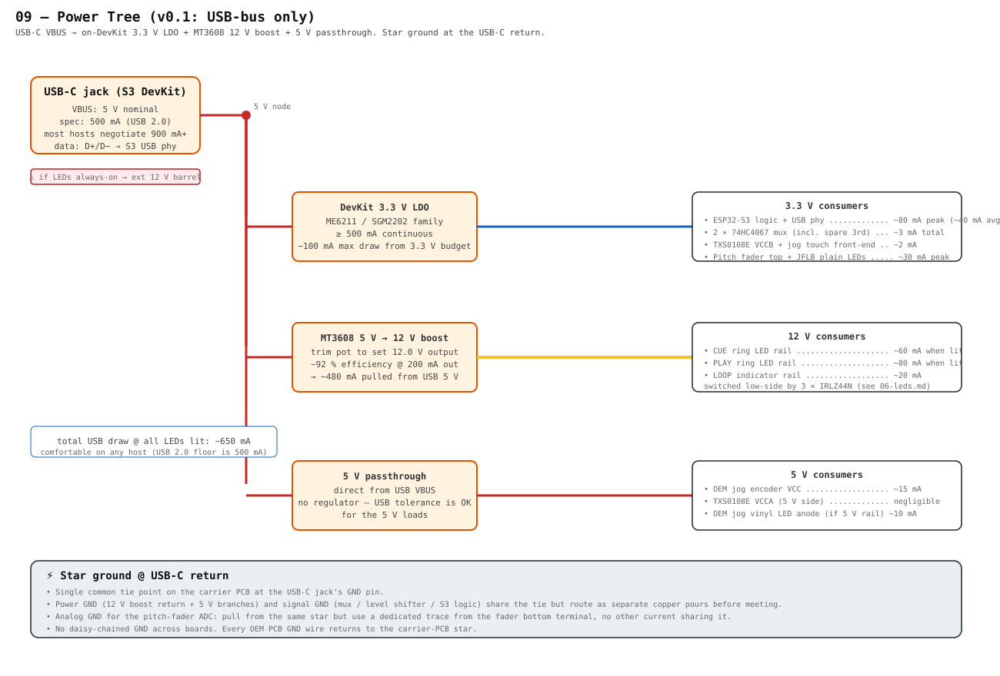

# 09 — Power Tree

> The v0.1 deck runs **entirely from USB VBUS**. The DevKit's onboard 3.3 V LDO powers the S3 logic, mux, sensors. A small **MT3608** boost off the same 5 V rail makes 12 V for the OEM CUE/PLAY/LOOP LED rings. A 5 V passthrough feeds the jog encoder and TXS0108E A-side. All grounds meet at a single star tie at the USB-C jack return.

---

## Rails at a glance

| Rail | Source | Consumers | Budget |
|---|---|---|---|
| **5 V (VBUS)** | USB-C jack on the S3 DevKit | DevKit LDO, MT3608 boost, jog encoder VCC, TXS0108E VCCA | host-negotiated, ≥ 500 mA |
| **3.3 V** | DevKit LDO (ME6211 / SGM2202 family, ≥ 500 mA spec) | S3 logic + USB phy, 2× 74HC4067 muxes, TXS0108E VCCB, jog-touch front-end, pitch fader top, JFLB plain LEDs | ~115 mA peak |
| **12 V** | MT3608 boost from VBUS | OEM CUE / PLAY / LOOP ring LED rails | ~160 mA when all rings lit |

## Budget calculation

| Block | Peak draw | Notes |
|---|---|---|
| S3 logic + USB phy | 80 mA | bursts higher during WiFi tx; covered by DevKit caps |
| Muxes + level shifter + sensors | 5 mA | negligible |
| Pitch fader + JFLB plain LEDs (4 of them) | 30 mA | from 3.3 V |
| **3.3 V subtotal** | **~115 mA** | |
| Jog encoder + TXS0108E A-side + jog vinyl LED | 25 mA | from 5 V |
| **MT3608 → 12 V LEDs (input side)** | ~480 mA | 160 mA × 12/5 / 0.92 (efficiency) |
| **5 V subtotal** | ~650 mA | LDO is fed from the same 5 V node; its 115 mA reaches the 3.3 V rail at LDO efficiency, but for budgeting we treat them stacked |

Total USB draw with everything lit ≈ **650 mA**. Within the USB-2.0 minimum 500 mA only if you keep the rings off the boost — most current hosts negotiate ≥ 900 mA at enumeration, so this is comfortable on any modern laptop or USB-PD wall wart.

## The three branches

### Branch 1 — DevKit 3.3 V LDO

Already on the S3 DevKitC-1; no work required. It accepts 5 V on VBUS and produces a clean 3.3 V at its output pin (the row labelled `3V3` on the DevKit). Tap the 3V3 pin on the carrier PCB and treat that as the rail for everything 3.3 V.

**Decoupling**: the DevKit already has bulk caps on both sides. Add **100 nF + 10 µF** at the carrier PCB's 3V3 entry point and **100 nF per IC** near each 74HC4067 / TXS0108E / MOSFET pull-up footprint.

### Branch 2 — MT3608 boost to 12 V

A trim-pot MT3608 board off AliExpress / DigiKey for $1–2. Wire VBUS in, trim the pot to **12.0 V** out (measure with a meter before connecting the LED rails), then route 12 V to the LED anode rail covered in [`06-leds.md`](./06-leds.md).

**Caps**: the MT3608 board has its own input/output caps. If you see ripple on the LED rail at the boost's switching frequency (typically ~1 MHz), add a **10 µF ceramic + 100 nF** at the LED rail entry. Doesn't matter for LED brightness but helps if the 12 V trace runs near analog signals.

**Inrush**: at boot, the MT3608 takes 100–200 ms to ramp. The S3 boots in ~30 ms, so it's running long before 12 V is up. The MOSFET gate pull-downs (Block 06) keep the LEDs off through this window so the boost has no load while it ramps.

### Branch 3 — 5 V passthrough

Direct from VBUS to:
- Jog encoder VCC (Lane 1 of [`00-board-map.md`](./00-board-map.md))
- TXS0108E VCCA (level shifter's 5 V side)
- Jog vinyl LED anode if the OEM hub PCB carries 5 V (verify per board)

No regulator needed — USB-bus 5 V (±0.25 V tolerance) is well inside what these loads accept.

## Star ground rules

**Single common tie point** on the carrier PCB at the USB-C jack's GND pin. Every GND wire — OEM PCB returns, MOSFET sources, MT3608 GND, ADC reference — comes back to that tie.

| Subsystem | Ground route |
|---|---|
| S3 + carrier-PCB digital | direct copper pour, ties to star |
| 12 V LED rail (MOSFET sources) | dedicated wire from LED row to star |
| Analog (pitch fader bottom terminal, ADC reference) | **separate dedicated trace** to star — nothing else sharing the return |
| Jog encoder GND | dedicated wire from JOGB ribbon to star |

**Anti-rules**:
- Don't daisy-chain GND through OEM boards.
- Don't reuse the fader's GND wire for any other load (it carries the ADC reference current and you'll see the noise on the pitch reading).
- Don't tie the MOSFET source bus straight to the carrier PCB digital GND pour — keep it on a fatter trace that meets digital GND only at the star tie.

## Optional: external 12 V DC barrel

If you decide to run the LED rings always-on (e.g. for stage visibility) and that pushes USB draw above what your host wants to give, swap the MT3608 boost for a small **12 V / 1 A DC barrel jack** in the back panel:

| | MT3608 from USB | 12 V DC barrel |
|---|---|---|
| Extra parts | none (already in BOM) | barrel jack, 12 V brick |
| Chassis impact | none | back-panel hole |
| Max LED draw | ~250 mA before USB complains | whatever the brick rates |
| Power-up sequencing | LEDs off until MT3608 ramps | LEDs available immediately |
| Travel-friendly | yes | needs the brick in the kit |

Stick with MT3608 for v0.1. The barrel is a v0.2 chassis option if always-on LEDs become a requirement.

## MK2-specific open items

- [ ] Confirm jog vinyl LED anode rail (5 V vs 3.3 V) when the unit is open
- [ ] Verify the OEM CUE/PLAY/LOOP rings are in fact on a 12 V rail (Pioneer's standard for this generation; check the service-manual schematic)
- [ ] Measure actual ring-LED current under operation so the boost trim pot can be re-tuned to the minimum sufficient voltage (every volt below 12 V buys efficiency)

## Bill of materials

| Part | Qty | ~Cost | Notes |
|---|---|---|---|
| MT3608 boost module (trim pot) | 1 | $1–2 | AliExpress / Amazon; pre-built board |
| 10 µF ceramic 0805 | 2 | <$0.10 | bulk on 3V3 + 12 V rails |
| 100 nF ceramic 0603 | 4–6 | <$0.10 | per-IC decoupling |
| Hookup wire (22 AWG for power, 28 AWG for signal) | ~50 cm | — | rail routing |
| Optional: 12 V / 1 A DC barrel jack | 0–1 | $2 | only if going to external 12 V (see above) |

Whole subsystem total **under $5**, excluding the DevKit itself.

---

## References

- Pioneer CDJ-1000MK2 service manual (RRV2802) — local copy at `docs/source/CDJ1000MK2-service-manual.pdf`. The DWR1370 SW Power Supply Assy schematic page (PSU board, deliberately *not* used in v0.1) shows the original rails for cross-reference.
- MT3608 datasheet — Aerosemi. Step-up DC-DC converter, 1.2 MHz switching, 4 A switch current limit. Typical efficiency 90+ % at the currents we're running.
- ME6211 datasheet — Microne. The DevKitC-1's onboard LDO; spec sheet documents the 500 mA continuous, 600 mA peak rating that backs our 3.3 V budget.
