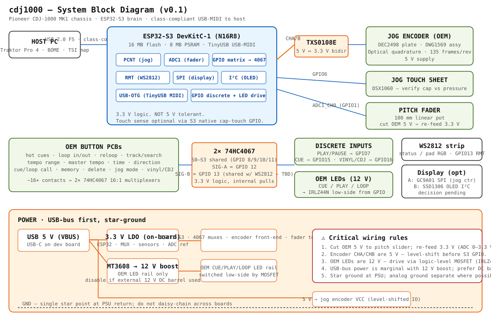

# Wiring documentation

Per-subsystem wiring docs for the **Pioneer CDJ-1000MK2 → ESP32-S3** build. (Target unit switched from MK1 to MK2 on 2026-06-03 — topology unchanged; deltas are noted inline.)

## Contents

| # | Subsystem | Status |
|---|---|---|
| 00 | [**Master board map**](./00-board-map.md) — physical layout + full wiring + per-board breakdown | ✅ v0.1 |
| 00b | System overview block diagram (SVG above) | ✅ v0.1 |
| 01 | [Jog encoder (quadrature → TXS0108E → PCNT)](./01-jog-encoder.md) | ✅ v0.1 |
| 02 | [Jog touch sheet (3 sensor paths)](./02-jog-touch.md) | ✅ v0.1 |
| 03 | [Pitch fader (3.3 V re-feed + ADC)](./03-pitch-fader.md) | ✅ v0.1 |
| 04 | [Button matrix (2× 74HC4067 + escape hatch for MUX C)](./04-buttons-mux.md) | ✅ v0.1 |
| 05 | [Discrete front switches (PLAY / CUE / VINYL / EJECT)](./05-discrete.md) | ✅ v0.1 |
| 06 | [LEDs (12 V ring + JFLB plain + jog vinyl)](./06-leds.md) | ✅ v0.1 |
| 07 | [OEM VFD reuse research](./07-display-research.md) — historical path comparison | ✅ v0.1 |
| 08 | [**Display — v0.1 JFLB LEDs only, Path D deferred to v0.2+**](./08-display.md) | ✅ v0.1 locked |
| 09 | Power (USB 5 V, 3.3 V LDO, MT3608 boost) | 🚧 TBD |

## GPIO summary (v0.1, tentative)

| GPIO | Function | Notes |
|---|---|---|
| 1 | Pitch fader wiper | ADC1_CH0. **Cut OEM 5 V, re-feed slider from 3.3 V.** |
| 4 | Jog encoder CH A | via TXS0108E (5 V→3.3 V). Routed to PCNT. |
| 5 | Jog encoder CH B | via TXS0108E. Routed to PCNT. |
| 6 | Jog touch sense | verify cap vs pressure sheet before final assignment. |
| 7 | PLAY/PAUSE button | discrete, internal pull-up. |
| 8 | Mux select S0 | shared across both 74HC4067. |
| 9 | Mux select S1 | shared. |
| 10 | Mux select S2 | shared. |
| 11 | Mux select S3 | shared. |
| 12 | Mux A SIG | reads 16 button channels. |
| 13 | Mux B SIG **/** WS2812 data | ⚠ conflict — must resolve. Likely move WS2812 to spare GPIO. |
| 14 | Reserved (display SCK if SPI) | |
| 15 | CUE button | discrete. |
| 16 | VINYL / CDJ switch | discrete. |
| 17 | I²C SDA (if OLED) | shared with possible mux relocation. |
| 18 | I²C SCL (if OLED) | |

> ⚠ The shared GPIO 13 between mux-B SIG and WS2812 in the v0.1 architecture is a known conflict — one of the two has to move when we lock the BOM.

## Critical wiring rules

1. **Pitch fader supply:** cut the OEM 5 V going to the fader and re-feed it from the S3's 3.3 V rail. The S3 ADC range is 0–3.3 V; feeding the wiper from 5 V will clip and damage. (Same as spectran's CDJ-100S step 6.)
2. **Jog encoder level-shift:** the encoder outputs are 5 V logic. S3 GPIO is **not** 5 V tolerant. Route CH A / CH B through a TXS0108E (or two 74LVC1T45) before they hit the S3.
3. **OEM 12 V LEDs:** drive the CUE / PLAY / LOOP LEDs through logic-level N-MOSFETs (IRLZ44N or similar) low-side switched from S3 GPIO. Don't try to source 12 V from the S3.
4. **USB-bus power budget:** marginal once you add a 12 V boost for OEM LEDs. If LEDs are always-on or heavily used, add a DC barrel jack and skip the boost from USB.
5. **Star ground:** single common return point at the PSU side. Don't daisy-chain grounds across the display, button, and jog boards.

## Reference material

- Pioneer CDJ-1000**MK2** Service Manual — doc **RRV2802**. Available via [ManualsLib](https://www.manualslib.com/manual/1059617/Pioneer-Cdj-1000mk2.html) and elektrotanya. (Different from the MK1 manual at instrumentalparts.com/content/pdf/CDJ1000MK1.pdf.)
- [spectran CDJ-100S MIDI Adapter](https://github.com/spectran/CDJ-100S-MIDI-Adapter) — `Connection_scheme.pdf` in their `Schematics/` folder. Closest prior art at the signal-tap level. (No LICENSE file — treat as reference only, do not redistribute.)
- [Lee Smith CDJ-1000 MK1 Teensy build — DJ TechTools 2017](https://djtechtools.com/2017/06/28/hacking-cdj-1000mk1-work-midi-controller-traktor-scratch/)
- [pestrela/dj_maps](https://github.com/pestrela/dj_maps) — Traktor mapping reference. (MIT.)
